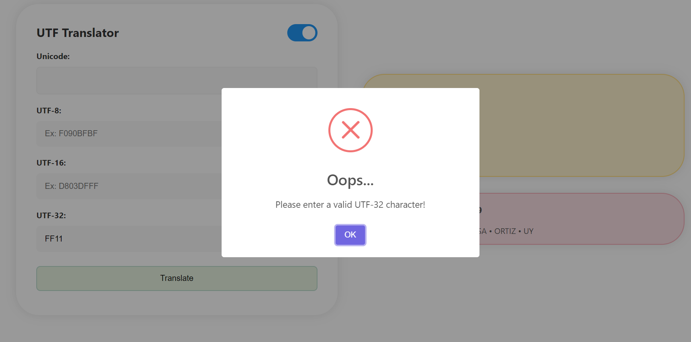

# Unicode Converter
**Unicode** is a universal character encoding standard that assigns a unique number to every character and symbol in the world's languages. It ensures that you can get or combine data using any combination of languages, as no other encoding standard covers all languages 1.

In the first section of the program we convert them to various UTF formats. 
**UTF-8** is a variable-length encoding method where each character can be represented using one to four bytes. It is backward compatible with ASCII, making it efficient for English characters.

**UTF-16** uses two or four bytes to represent each character. It is ideal for most Asian text but requires more bytes for English characters 1.

**UTF-32** is a fixed-length encoding scheme that uses four bytes for each character, providing a direct mapping between code points and bytes.
# Unicode translator 

