# Recording Link
[Recording](https://drive.google.com/drive/folders/1-UHB07ME1CerxTOGly9Qz1lIjNPBM-iL)
(Uploaded through drive because file is too big)

# Unicode Converter
**Unicode** is a universal character encoding standard that assigns a unique number to every character and symbol in the world's languages. It ensures that you can get or combine data using any combination of languages, as no other encoding standard covers all languages 1.
In the first section of the program we convert them to various UTF formats. 

**UTF-8** is a variable-length encoding method where each character can be represented using one to four bytes. It is backward compatible with ASCII, making it efficient for English characters.

**Unicode to UTF-8:** 
To convert Unicode to UTF-8 format we:

- Check the Range: Determine if the Unicode character falls within the ASCII range (0x0000 to 0x007F). Characters in this range can be represented directly in UTF-8 using a single byte and can be directly encoded. For example, the character 'A' (U+0041) is encoded as 0x41 in UTF-8.

- Encode Non-ASCII Characters: For characters outside the ASCII range, UTF-8 uses a variable-length encoding scheme. Characters in the range U+0080 to U+07FF are encoded using two bytes, while characters in the range U+0800 to U+FFFF are encoded using three bytes. Characters beyond U+FFFF are encoded using four bytes.
Construct the UTF-8 Byte Sequence: For each character, construct the appropriate byte sequence according to its Unicode code point and the rules of UTF-8 encoding.

**UTF-16** uses two or four bytes to represent each character. It is ideal for most Asian text but requires more bytes for English characters 1.

**Unicode to UTF-16:**
To convert Unicode to UTF-16 we:

- Check the Range: Determine if the Unicode character falls within the Basic Multilingual Plane (BMP), which includes characters from U+0000 to U+FFFF. Characters outside the BMP (U+10000 to U+10FFFF) require a surrogate pair in UTF-16. While characters within it can be converted through direct mapping.

- Encode Characters Beyond the BMP: Characters outside the BMP are represented using a surrogate pair in UTF-16. This involves encoding the character as two 16-bit values, with the first value in the range U+D800 to U+DBFF and the second value in the range U+DC00 to U+DFFF. The first value is known as the high surrogate, and the second value is known as the low surrogate. Together, they form a single character in the Unicode standard.

**UTF-32** is a fixed-length encoding scheme that uses four bytes for each character, providing a direct mapping between code points and bytes.

**Unicode to UTF-32:**
- To convert Unicode to UTF-32, first ensure that the Unicode code point is within the valid range for UTF-32, which is from 0x00000000 to 0x10FFFF. Since UTF-32 uses a fixed-length encoding scheme with four bytes for each character, providing a direct mapping between code points and bytes, the conversion process involves taking the Unicode code point and encoding it as a 32-bit sequence. This is done by converting the code point to its hexadecimal representation and then padding it with zeros to ensure it is 8 hexadecimal digits long, which corresponds to 4 bytes. This method ensures that each Unicode character is represented in UTF-32 as a fixed-length sequence.

| Test Case 1 | Test Case 2 |
| ------- | ------- |
| 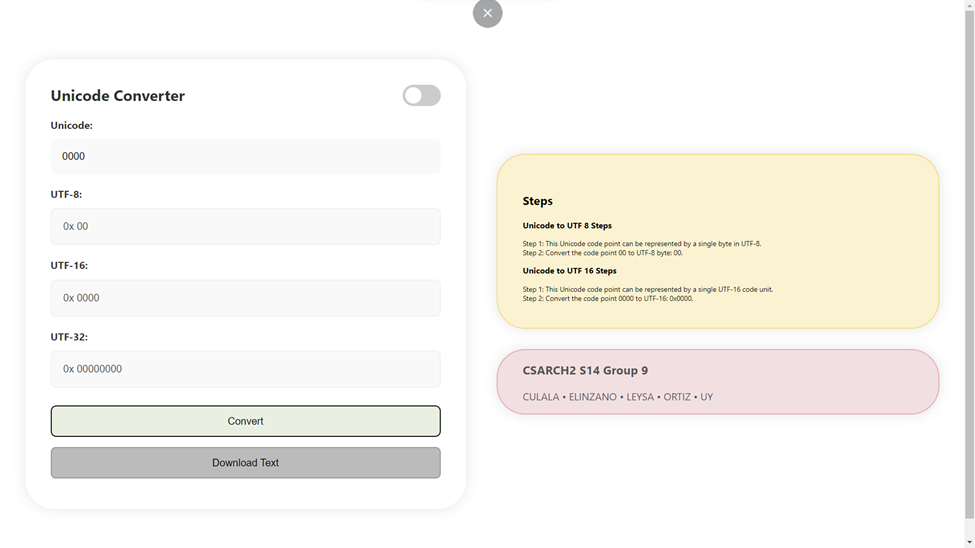 | 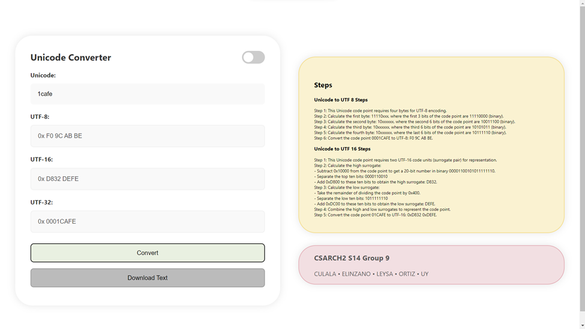 |
| Input is Zero| Input is valid |

| Test Case 3 | Test Case 4 |
| ------- | ------- |
| 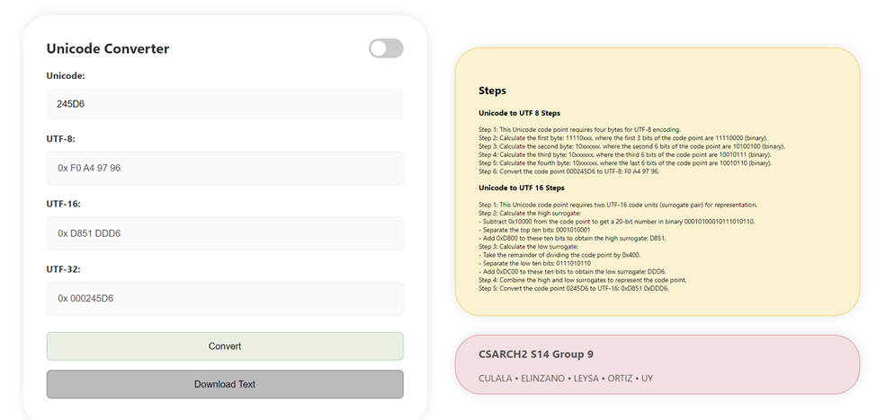 | 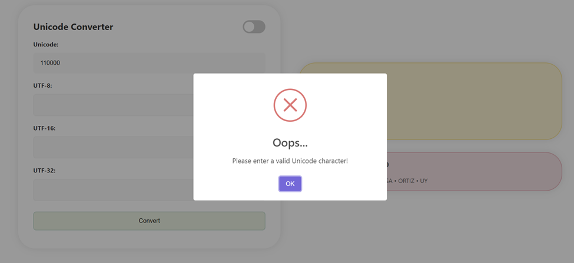 |
| Input is Valid | Invalid input |

# Unicode translator 
In the second section of the program, UTF encoded characters are then translated back into their Unicode equivalent. 

**UTF-8 to Unicode**  
- UTF-8 uses a variable-length encoding scheme, where characters can be represented using one to four bytes. The first byte of the sequence indicates the number of bytes used to represent the character. By examining the binary representation of the first byte, you can determine the length of the sequence. Each subsequent byte in the sequence contributes its relevant bits to form the Unicode code point. This process allows you to decode the UTF-8 encoded character back into its original Unicode code point, which can then be used to represent the character in Unicode.
  
| Test Case 1 | Test Case 2 |
| ------- | ------- |
| 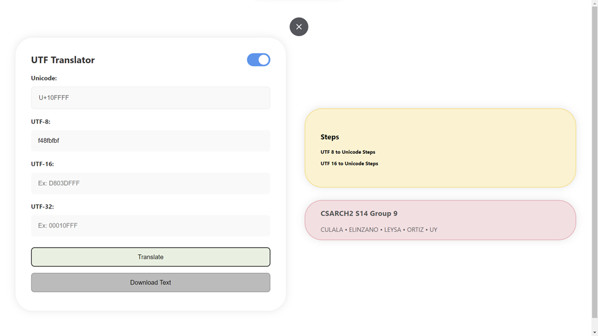 |  |
| Input is valid| Input is valid |

| Test Case 3 | Test Case 4 |
| ------- | ------- |
| 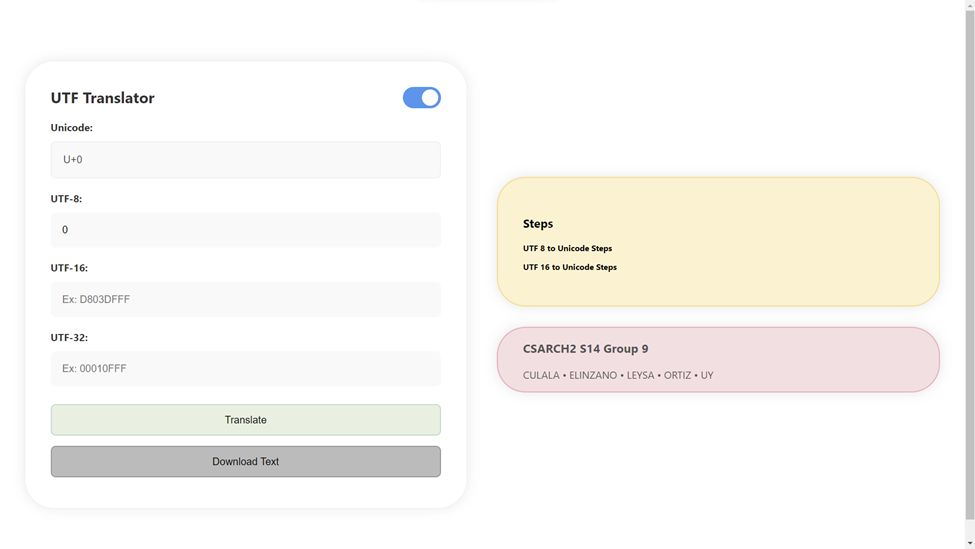 | 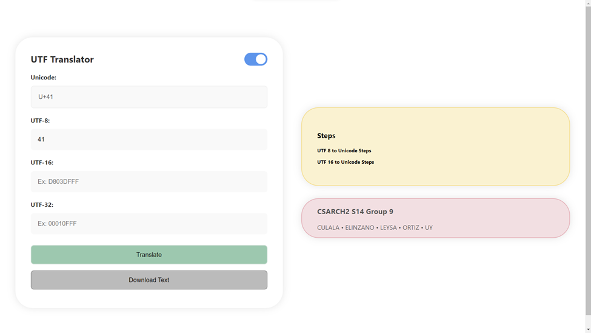 |
| Input is zero | Invalid valid |

**UTF-16 to Unicode**  
- To convert UTF-16 to Unicode, the inputted value must have 1 to 8 hex digits because UTF-16 has max length encoding of 16 bits. If the input is less than or equal to 16 bits or 4 hex digits, display the inputted hex digit as the unicode. Otherwise, separate the UTF-16 code unit into upper and lower surrogates. Then calculate the upper surrogate value by subtracting 0xd800 from the high-surrogate code unit. For the lower surrogate value, subtract 0xdc00 lower-surrogate unit. The two surrogates result must then be combined and added with 0x10000 to translate it back to unicode.

| Test Case 1  | Test Case 2 |
| ------- | ------- |
|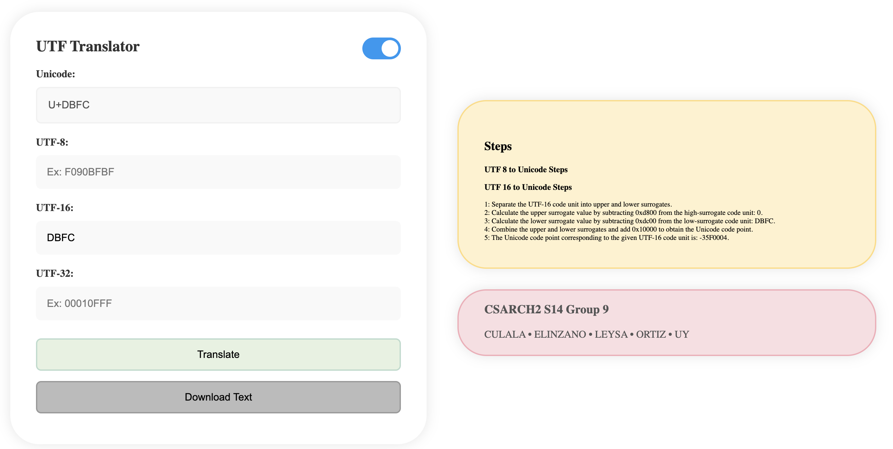|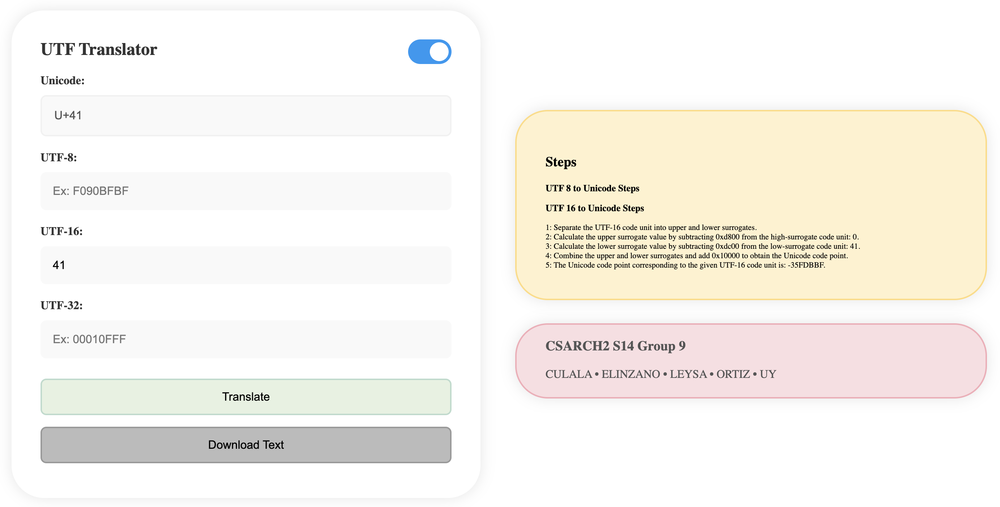|
|  Valid Input  |  Valid Input |

| Test Case 3  | Test Case 4 |
| ------- | ------- |
|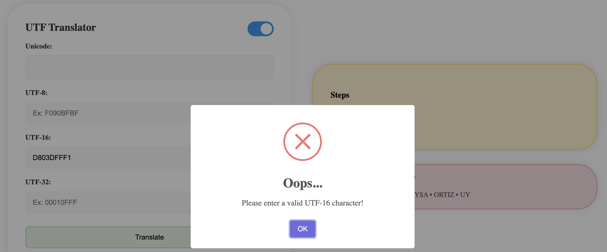|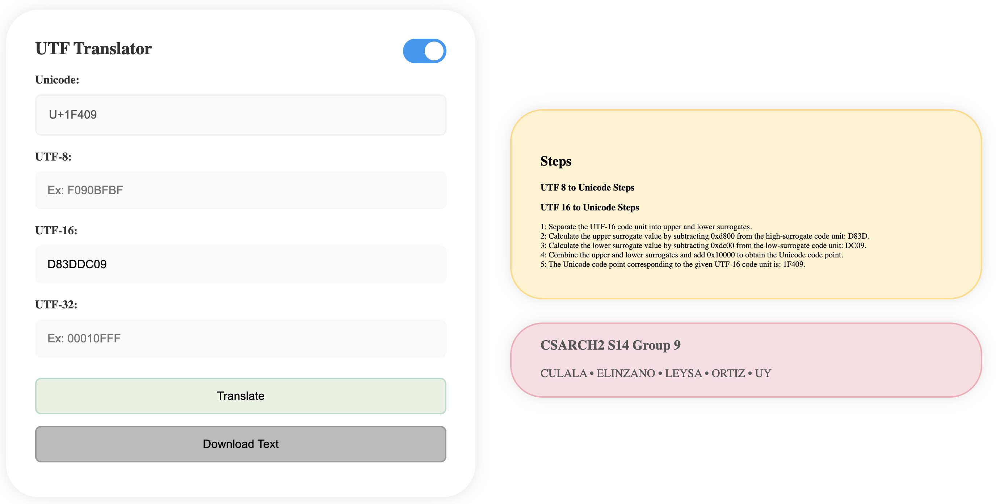|
|  Invalid Input  |  Valid Input |

**UTF-32 to Unicode:**
- To convert UTF-32 to Unicode, first check if the number of hex digits are 8, as UTF-32 uses fixed-length encoding with 32 bits. If the input is valid, directly copy each character from the UTF-32 format to Unicode, as UTF-32 represents each character as a fixed-length 32-bit sequence. This direct mapping allows for a straightforward conversion process, where each 8-digit hexadecimal number corresponds to a unique Unicode code point. This method ensures that the conversion is precise and efficient, making it suitable for applications requiring precise control over character encoding.

| Test with Input Error| Test with correct length |
| ------- | ------- |
|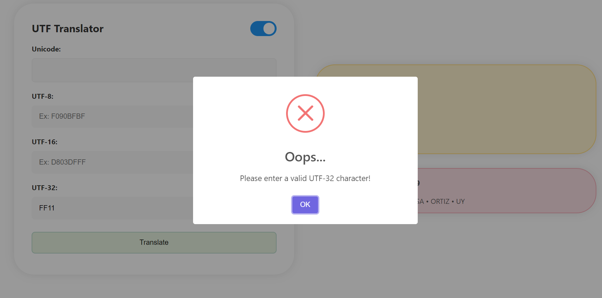|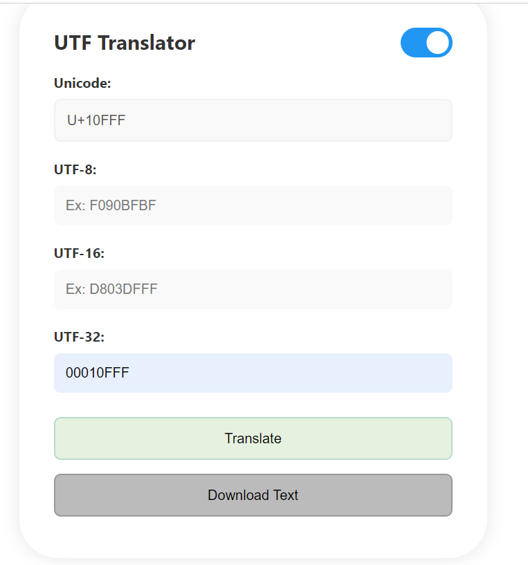|

# Analysis
One of the challenges faced by the group was dealing with the varying lengths of the input data. It was crucial to address this issue effectively in the coding process to ensure that the output format remained consistent and correct regardless of the input length. To tackle this challenge, the group implemented a padding technique wherein the input sequences were padded to the maximum length of particular encoding-scheme.  By doing so, uniformity was achieved without altering the original values of the inputs. 
